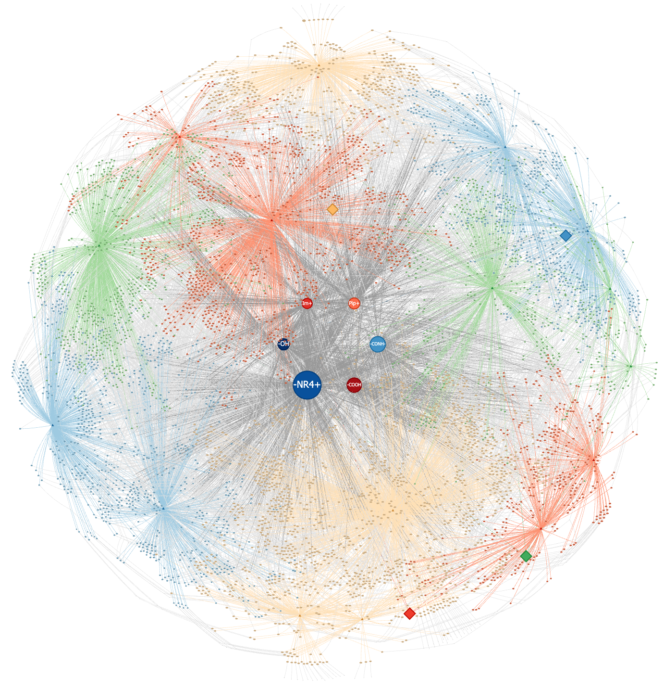

# Polymer Electrolyte Knowledge Graph Construction

This project provides an automated pipeline for extracting structured data from scientific literature (PDFs) and constructing a Knowledge Graph (KG) focused on polymer electrolyte systems. It leverages Large Language Models (LLMs) to parse complex chemical information and visualizes the relationships between polymers, salts, solvents, and their properties.

## Features

- **Automated PDF Extraction**: Parses scientific papers to extract key entities and properties using LLMs.
- **Structured Data Extraction**: Identifies and standardizes information such as:
  - Polymer Matrix (e.g., PVA, PAM)
  - Electrolyte Salts & Concentrations
  - Solvents & Fractions
  - Ionic Conductivity
  - Test Temperatures
  - Mechanical Properties (Tensile Strength, Elongation)
- **Knowledge Graph Construction**: Builds a directed graph linking chemical substances and their properties.
- **Interactive Visualization**: Generates interactive HTML visualizations of the knowledge graph using `pyvis`.
- **Parallel Processing**: Supports concurrent processing of multiple PDFs using multiple API keys to speed up extraction.

## Visualization Preview



### Interactive Graph
You can explore the interactive version of the graph online:
- **[Click here to view interactive graph](https://htmlpreview.github.io/?https://github.com/zh-ouie/knowledgeGraph/blob/main/img/kg_property_instantiation.html)** (via htmlpreview)

> **Note**: GitHub does not render HTML files directly. To view it properly, use the link above.

## Prerequisites

- Python 3.8+
- An API Key for an OpenAI-compatible LLM service (e.g., OpenAI, DashScope/Qwen).

## Installation

1.  **Clone the repository:**
    ```bash
    git clone <repository-url>
    cd KnowledgeGraph
    ```

2.  **Install dependencies:**
    ```bash
    pip install -r requirements.txt
    ```

## Configuration

Create a `.env` file in the root directory to configure your API keys and model settings. You can use the provided template below:

```env
# Primary API Key
API_KEY=your_api_key_here

# Optional: Additional API Keys for parallel processing (up to 5 supported in test scripts)
API_KEY_2=your_second_api_key
API_KEY_3=your_third_api_key

# Base URL for the LLM API (if using a custom endpoint or compatible service like DashScope)
BASE_URL=https://dashscope.aliyuncs.com/compatible-mode/v1

# Model Name (optional, defaults can be set in code)
# MODEL_NAME=qwen-max
```

## Usage

### 1. Data Extraction (PDF to JSON)

Use `test-process.py` to process a folder of PDF files. This script initializes the `PDFProcessor`, reads PDFs, sends content to the LLM, and saves the extracted structured data.

1.  Open `test-process.py`.
2.  Modify the `pdf_dir` variable to point to your folder containing PDF files.
    ```python
    pdf_dir = r"/path/to/your/pdf_folder"
    ```
3.  Run the script:
    ```bash
    python test-process.py
    ```
    The results will be saved as a JSON file (e.g., `hydrogel_electrolytes.json`) in the specified results directory.

### 2. Knowledge Graph Construction (JSON to Graph)

Use `test-kg.py` to build and visualize the knowledge graph from the extracted JSON data.

1.  Open `test-kg.py`.
2.  Update the input JSON path and output paths:
    ```python
    kg.build_from_electrolytes_file(r"/path/to/your/results/hydrogel_electrolytes.json")
    kg.export_to_json(r"/path/to/your/output/kg_output.json")
    kg.visualize_kg(r"/path/to/your/output/kg.html")
    ```
3.  Run the script:
    ```bash
    python test-kg.py
    ```
    This will generate an interactive `kg.html` file that you can open in your web browser to explore the knowledge graph.

## Project Structure

- **`pdfProcessor.py`**: Core logic for reading PDFs and interacting with the LLM API to extract data. Handles reference removal and response parsing.
- **`KGbuilder.py`**: Logic for building the Knowledge Graph. Handles node creation, relationship linking, and data normalization (e.g., unit conversion for conductivity).
- **`util/`**:
  - **`API_KEY.py`**: Wrapper for the OpenAI API client.
  - **`prompts.py`**: Contains the specific prompt engineering (Chain-of-Thought) used to guide the LLM in extracting electrolyte data.
- **`test-process.py`**: Example script for batch processing PDFs.
- **`test-kg.py`**: Example script for building and visualizing the graph from extracted data.

## Customization

- **Prompts**: You can modify `util/prompts.py` to adjust the extraction rules or add new fields to capture.
- **Graph Logic**: Modify `KGbuilder.py` to change how nodes and edges are defined or to add new types of relationships.

## License

[MIT License](LICENSE)
